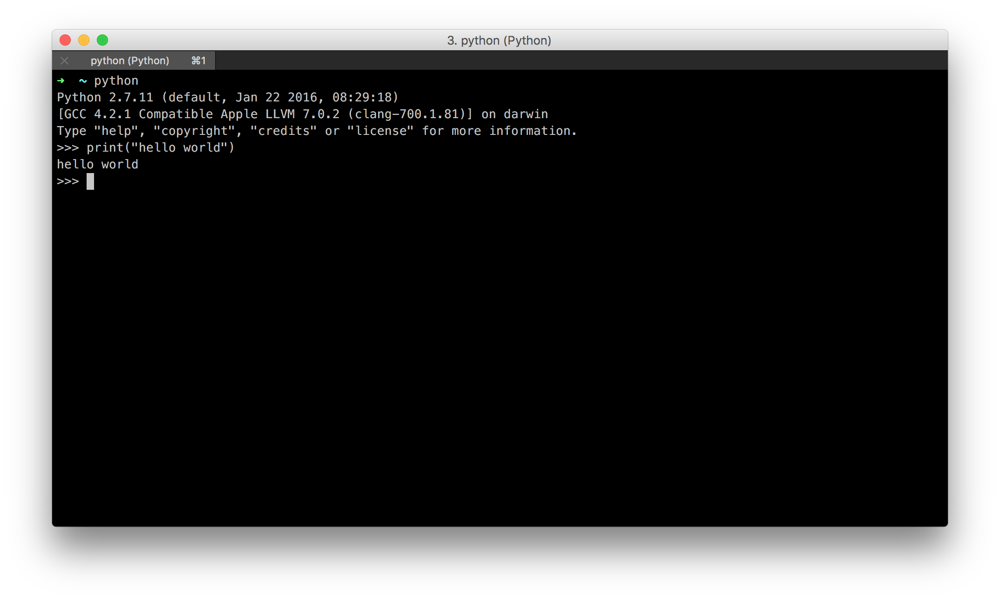
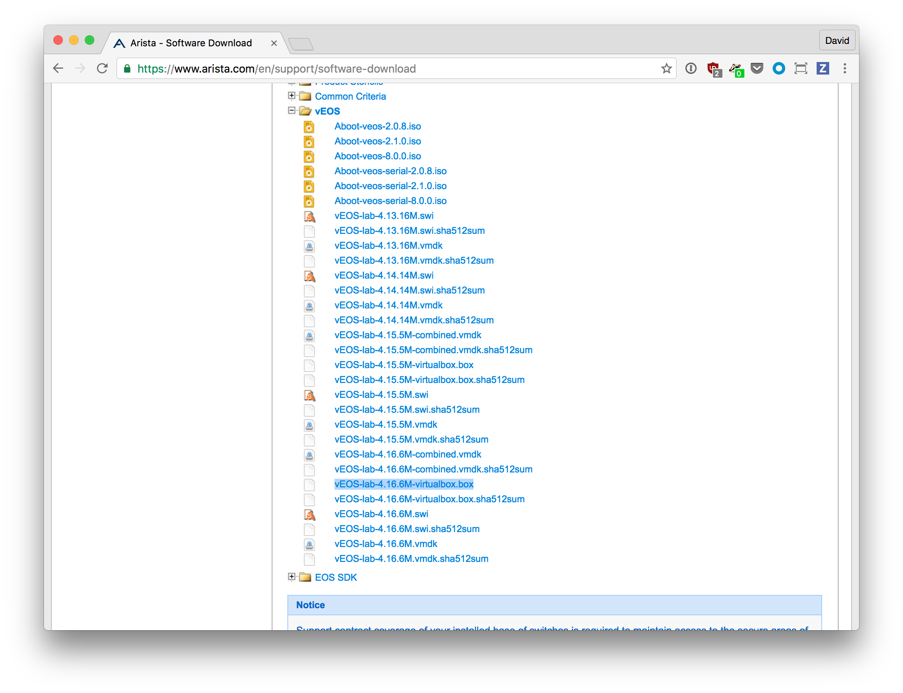
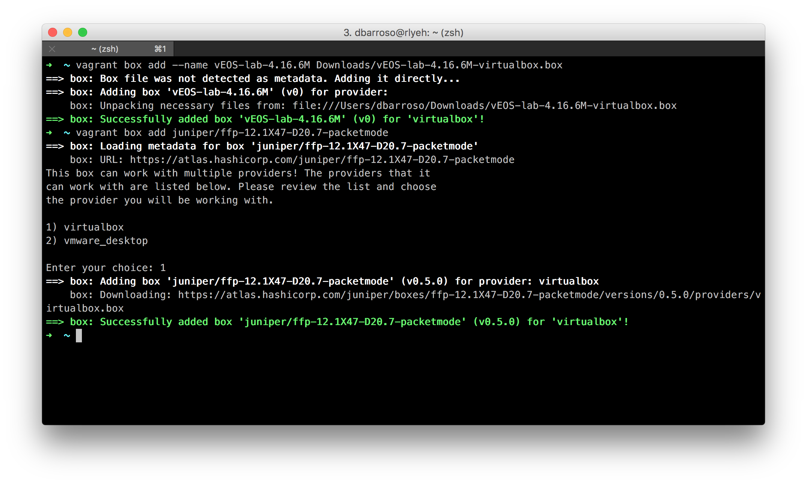
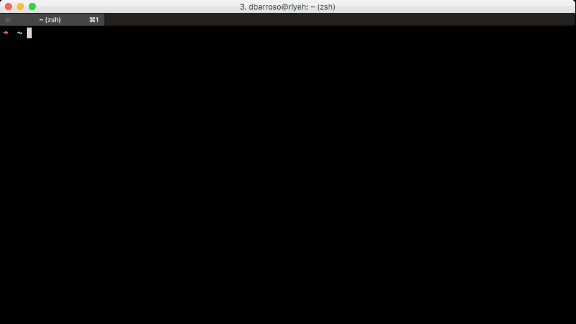

* [Goals](#goals)
* [Instructions](#instructions)
	* [Requirements](#requirements)
	* [Git](#git)
	* [Python](#python)
	* [vagrant](#vagrant)
		* [vagrant boxes](#vagrant-boxes)
	* [Testing the setup](#testing-the-setup)
	* [Demo](#demo)
* [Summary](#summary)

# Goals

In this lab we are going to set up an environment that will allow us to build reproducible labs that we will be able to use throughout the upcoming tutorials.

# Instructions

## Requirements

1. [git](https://git-scm.com/downloads)
1. [python 2.7](https://www.python.org/downloads/)
1. [VirtualBox](https://www.virtualbox.org/wiki/Downloads)
1. [Vagrant](https://www.vagrantup.com/docs/installation/)
1. [virtualenvwrapper](http://virtualenvwrapper.readthedocs.io/en/latest/install.html) (optional but recommended)

## Git

Installing git is very straightforward, just follow the instructions for your operating system.

## Python

To install python follow the instructions for your operating system. To verify python is installed correctly open a terminal, execute the command ``python`` and then execute ``print("hello world")``.

## vagrant

To install Vagrant install first VirtualBox and then Vagrant. In both cases follow the instructions for your operating system.

### vagrant boxes

Now we are going to need a few boxes, these boxes will help us provision clean labs every time we need them. To support the following tutorials we will use a box containining vEOS and another one containing JunOS. The main reason for this is because they are the only ones that provide them without needing to pay or contact some sales representative.

First of all, you will have to go to arista [download](http://www.arista.com/en/support/software-download) page (you can register for free) and download the file ``vEOS-lab-4.16.6M-virtualbox.box`` under the vEOS section.

Then you will have to execute the following commands:

    vagrant box add --name vEOS-lab-4.16.6M Downloads/vEOS-lab-4.16.6M-virtualbox.box
    vagrant box add juniper/ffp-12.1X47-D20.7-packetmode

## Testing the setup

Now that everything is in place let's clone the repository where the tutorial lives and try to start the test lab.

    git clone https://github.com/dravetech/network-tutorials.git
    cd network-tutorials/labs/lab1
    vagrant up

The last command will initialize the lab. To see the description of the lab check the contents of the file ``labs/lab1/Vagrantfile``. You should be able to connect to the vEOS and the JunOS box with the commands ``vagrant ssh eos`` and ``vagrant ssh junos`` respectively.

When you are done with the lab you can destroy it to free up resources with ``vagrant destroy``.

## Demo

Below you can find a video with the result of running this tutorial (click the gif to go to the YouTube video)

# Summary

As you can see, building the environment wasn't hard. From now on, we will be able to destroy and recreate the lab as we require it.
